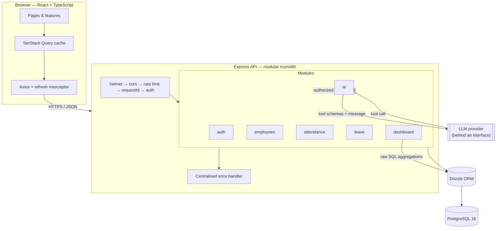
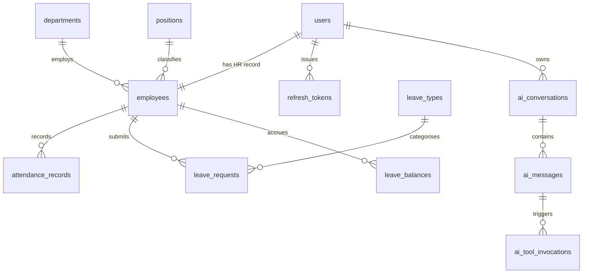
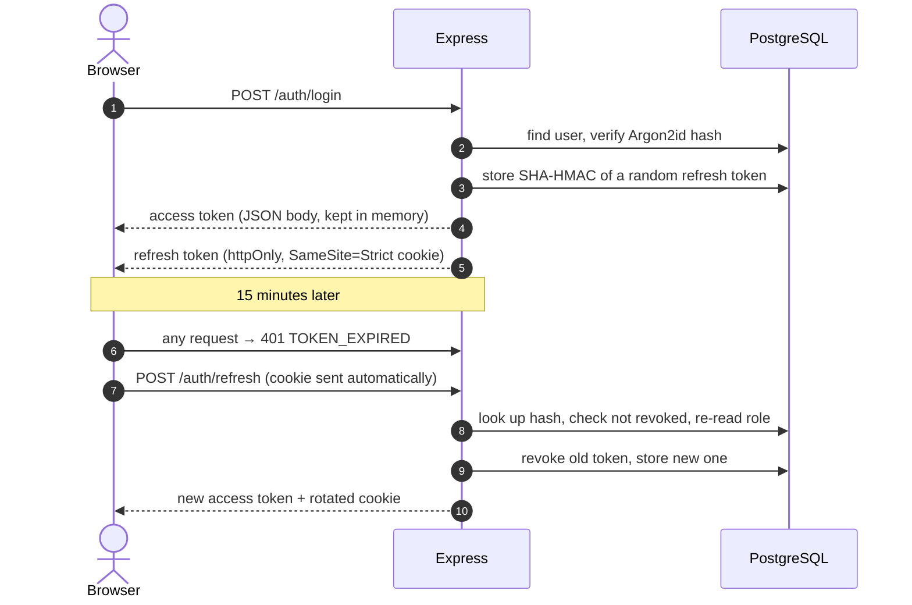
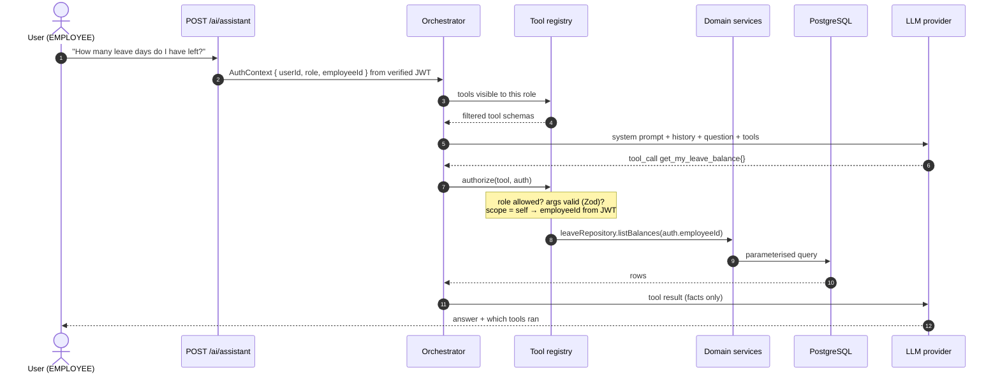

# AI-Powered HRM

A Human Resource Management system for a small company, with an AI assistant that answers
questions about HR data **without ever being given access to the database**.

TypeScript end to end — React + Vite on the front, Express + PostgreSQL behind, Drizzle ORM
for schema and migrations, Docker Compose to run the whole thing, and 216 tests that run
against a real database.

---

## Why this project exists

Most HRM demos are CRUD forms over a few tables. Two things here are meant to be worth
talking about instead:

1. **The AI layer is a real authorization problem, solved in the backend.** The language
   model chooses *which question to ask*; the server decides *whether this user may ask it*.
   Section [AI architecture](#ai-architecture) explains how, and there is a test suite that
   forces the model to attempt a privilege escalation and asserts that it fails.

2. **The business rules are enforced where they cannot be bypassed.** Double check-in is
   prevented by a unique index rather than an `if` statement, leave approval deducts the
   balance inside a transaction with a row lock, and a CHECK constraint refuses to store a
   balance that exceeds its entitlement even if the application logic is wrong.

Design decisions, including the ones that were rejected, are written up in
[`docs/DESIGN.md`](docs/DESIGN.md).

---

## Features

| Module | What it does |
|---|---|
| **Authentication** | Argon2id password hashing, short-lived JWT access tokens, rotating refresh tokens stored hashed in the database with reuse detection, password change with session revocation |
| **Employees** | Create (account + HR record + leave balances in one transaction), search, filter, sort, paginate, terminate; field-level authorization on salary |
| **Departments & positions** | CRUD with live headcount, deactivation instead of deletion, foreign keys that refuse to orphan data |
| **Attendance** | Check in / check out, late and overtime rules driven by configuration, HR corrections that recompute derived fields, monthly aggregates |
| **Leave** | Request → approve / reject / cancel state machine, working-day counting that skips weekends, overlap detection, balance accounting under a row lock |
| **Dashboard** | Headcount, today's attendance, pending approvals, and four charts built from raw SQL aggregations |
| **AI HR Assistant** | Tool-calling against approved backend functions, role-filtered tool list, per-tool authorization, full audit trail, works offline with no API key |

Deliberately **not** built: payroll calculation and recruitment. Reasoning in
[`docs/DESIGN.md` §1](docs/DESIGN.md).

---

## Screenshots

> Run `npm run db:seed` and sign in as `hr@hrm.local` to reproduce these.
> _(Add your own screenshots here before submitting — a dashboard, the leave queue, and the
> assistant showing its tool calls are the three worth including.)_

---

## Architecture



**Modular monolith**, not microservices. The problem microservices solve — independent
scaling and independent deployment by separate teams — does not exist here, while the cost
does: approving leave writes to two tables atomically, which would become a distributed saga.
The module boundaries are real (`modules/leave` never reaches into another module's
repository), so they remain the extraction seam if that ever changes.

Each module is layered:

```
modules/leave/
  leave.routes.ts       routing + which middleware applies
  leave.controller.ts   HTTP only: parse request → call service → shape response
  leave.service.ts      business rules, transactions. No req/res, no SQL.
  leave.repository.ts   data access. No business rules.
  leave.policy.ts       pure functions — testable with no I/O
  leave.schema.ts       Zod schemas: the single source of truth for validation
```

The controller/service split is not ceremony: the AI tool layer calls
`leaveService.getBalance()` directly, which is only possible because services know nothing
about Express.

---

## Technology choices

| Decision | Alternative | Why |
|---|---|---|
| PostgreSQL | MongoDB | The data is relational and approving leave must be transactional. Referential integrity and ACID are the requirements. |
| Drizzle ORM | Prisma | Drizzle's schema *is* TypeScript, migrations are generated as plain reviewable `.sql`, and its query builder stays close to the SQL it emits — which matters when the point is to demonstrate SQL, not to hide it. Prisma has the friendlier API and a bigger ecosystem; that was the trade-off. |
| Raw SQL for dashboards | ORM query builder | `FILTER (WHERE …)`, `generate_series`, and window functions are clearer written out than expressed through a builder. Each of those queries is covered by an integration test, because TypeScript cannot check them. |
| JWT + rotating refresh token | Server-side sessions | Stateless verification on the hot path, with a revocation point every 15 minutes. See [Authentication](#authentication). |
| Refresh token in httpOnly cookie | localStorage | `localStorage` is readable by any script, so one XSS is a 7-day account takeover. The CSRF risk this introduces is handled with `SameSite=Strict` and a path-scoped cookie. |
| Argon2id | bcrypt | Memory-hard, so GPU cracking is expensive. bcrypt would not be wrong. |
| Zod | Joi, express-validator | Schemas infer TypeScript types, so the runtime check and the compile-time type cannot drift. The same schemas validate AI tool arguments. |
| TanStack Query | Redux | Almost all state here is *server* state. Redux would mean hand-writing caching, refetching and invalidation. |

---

## Database

13 tables. Full ERD and the reasoning behind each constraint is in
[`docs/DESIGN.md` §3](docs/DESIGN.md).



**Constraints that encode business rules**, rather than trusting application code:

| Constraint | What it prevents |
|---|---|
| `attendance_records (employee_id, work_date)` UNIQUE | Double check-in. Two concurrent requests both pass an application-level "does a record exist?" check; only one survives a unique index. |
| `leave_balance_within_entitlement` CHECK | A balance where used days exceed the entitlement, whatever the service layer believes |
| `employees_termination_consistent` CHECK | A terminated employee with no termination date, or vice versa |
| `leave_decision_consistent` CHECK | A request marked approved with no record of who decided it |
| `leave_dates_ordered` CHECK | Negative-length leave |
| `users_email_lower_unique` | Two accounts answering to the same login in different cases |
| `ON DELETE RESTRICT` on department/position | Orphaning employees by deleting a department |

**Deletion strategy:** nothing is hard-deleted. People are `TERMINATED` with a date;
departments and positions are deactivated. A terminated employee is a real business state
that HR still needs the history of — not a tombstone every query has to remember to filter.

---

## Authentication



Three details worth pointing out:

- **Two tokens, two jobs.** The access token is a stateless JWT — verified with no database
  round trip, which is the whole benefit and also the whole drawback, so it lives 15 minutes.
  The refresh token is an opaque random string stored *hashed*; being a database row is what
  makes logout, revocation and theft detection possible.
- **Rotation with reuse detection.** Every refresh issues a new token and revokes the old one.
  A well-behaved client never presents a revoked token — seeing one means two parties hold it,
  so *every* session for that user is revoked. This is tested.
- **Login never says which half was wrong.** Unknown email and wrong password return the same
  code and the same message, and an unknown email is still verified against a dummy hash so
  the two take the same time. Otherwise the endpoint is an account-enumeration oracle.

---

## Authorization

Three roles, and authorization enforced in three places — none of which is the frontend.

| Capability | ADMIN | HR | EMPLOYEE |
|---|:--:|:--:|:--:|
| List / search all employees | ✅ | ✅ | ❌ |
| View any employee's detail | ✅ | ✅ | own only |
| **View `base_salary`** | ✅ | ✅ | **own only** |
| Create employee accounts | ✅ | ✅ (EMPLOYEE role only) | ❌ |
| Create HR / ADMIN accounts | ✅ | ❌ | ❌ |
| Approve / reject leave | ✅ | ✅ | ❌ |
| Correct attendance | ✅ | ✅ | ❌ |
| Organisation dashboard | ✅ | ✅ | ❌ |
| AI — personal questions | ✅ | ✅ | ✅ |
| AI — organisation questions | ✅ | ✅ | ❌ |

1. **Route middleware** (`requireRole`) — coarse gate on the endpoint.
2. **Service layer** (`assertCanAccessEmployee`) — row-level scope, because the answer depends
   on which record was requested.
3. **Response mapper** — `baseSalary` is stripped for viewers who may not see it. It is
   *absent*, not null, so a frontend bug cannot render it as `0`.

For list endpoints, a non-privileged caller's `employeeId` filter is **overwritten** rather
than validated. There is no code path in which an employee sees another employee's records,
so a forgotten check cannot leak data.

The React app hides what a role cannot use, but that is user experience, not security.

---

## AI architecture

> The model never receives database access, never receives credentials, and never decides
> what a user may see. It chooses **which question to ask**; the backend decides **whether
> this user may ask it**.



### Why the model is not given SQL

Text-to-SQL means the model's output is executed against the database. Then the only thing
between an employee and `SELECT base_salary FROM employees` is the model's willingness to
refuse — which is one prompt injection away. With tools, that request fails because **no such
tool is exposed to that role**, and no tool anywhere returns salary.

Tools are also testable. `get_my_leave_balance` has a fixed signature that can be asserted on;
a generated SQL string cannot.

### The tool registry

| Tool | Roles | Scope |
|---|---|---|
| `get_my_attendance_summary` | all | self |
| `get_my_leave_balance` | all | self |
| `get_my_leave_requests` | all | self |
| `get_headcount` | HR, ADMIN | organisation |
| `get_department_headcount` | HR, ADMIN | organisation |
| `get_attendance_statistics` | HR, ADMIN | organisation |
| `get_late_employees` | HR, ADMIN | organisation |
| `get_pending_leave_requests` | HR, ADMIN | organisation |
| `get_leave_statistics` | HR, ADMIN | organisation |
| `search_employees` | HR, ADMIN | organisation, salary excluded from the return type |

Three properties make this hold:

1. **The tool list is filtered by role before the model sees it.** An employee is never told
   `get_late_employees` exists. There is nothing to jailbreak towards.
2. **Self-scoped tools have no `employeeId` parameter at all.** The identity comes from the
   verified JWT. An injected "call it with employeeId 42" produces an argument that Zod
   strips before the handler runs — and the handler was never reading it anyway.
3. **No tool can return salary.** Not "does not currently" — the return types have no such
   field. `search_employees` maps rows through a DTO with nothing to populate.

Authorization is re-checked at execution time, not only at list time, so a hallucinated or
injected tool name is refused rather than silently succeeding.

### Threat model

| Threat | Mitigation |
|---|---|
| Direct prompt injection | Role-filtered tool list; no salary tool exists for any role; scope injected from the JWT |
| Indirect injection (hostile text stored in an HR record) | Tool results are inserted as structured JSON in a dedicated role, never concatenated into the prompt; the system prompt states that tool output is data, not instructions |
| Fabricated HR facts | The system prompt forbids answering data questions without a tool result, and the API returns which tools ran — the UI shows them, so an unsourced answer is visible |
| Cost / abuse | Per-user hourly quota counted in the database, per-IP burst limiter, capped tool-call iterations, request timeout |
| Provider outage or malformed response | Typed provider errors → HTTP 503 with a clear message. Never a made-up answer. |
| Audit | Every tool call, **including refused ones**, is written to `ai_tool_invocations` with user, arguments and outcome |

### Provider abstraction

```ts
interface LlmProvider {
  readonly name: string;
  chat(request: LlmChatRequest): Promise<LlmChatResponse>;
}
```

Three implementations: an OpenAI-compatible adapter (works with OpenAI, Groq, OpenRouter,
Together, or a local Ollama), an Anthropic adapter, and `FakeLlmProvider`.

The fake one earns its place twice. It lets the security tests **force** the model to attempt
a specific privilege escalation — you cannot test that a hostile tool call is refused if you
cannot make the model attempt one. And it lets the app run with no API key at all: it routes a
handful of questions by keyword to *real* tool calls, so a reviewer can clone the repo and
watch the whole authorization pipeline work for free.

What `fake` cannot do is write prose: it prints the tool's JSON result verbatim under a notice
saying so. Everything upstream of that — routing, authorization, the audit trail — is the real
thing.

### Running a real model without an API key

A local [Ollama](https://ollama.com) server speaks the OpenAI Chat Completions shape, so it
needs no code change — only configuration:

```bash
ollama pull qwen2.5:3b
```

```ini
AI_PROVIDER=openai
AI_MODEL=qwen2.5:3b
AI_API_KEY=ollama              # unused by Ollama; the schema only requires it to be non-empty
AI_BASE_URL=http://localhost:11434/v1
AI_TIMEOUT_MS=60000            # the first request pays for loading the model into memory
```

Two things decide whether this is pleasant or unusable:

**Pick a model that supports tool calling.** The assistant is a tool-calling loop; a model
without that capability will answer from the prompt alone and reach none of your data. The
`qwen2.5` and `llama3.1` families do.

**Pick one that fits in VRAM.** This matters more than parameter count. A 7B model at roughly
5&nbsp;GB does not fit a 6&nbsp;GB card once the display takes its share, so Ollama splits the
layers — and the fraction left on the CPU dominates the runtime. Measured on a 6&nbsp;GB
RTX 4050, `qwen2.5:7b` loaded at 18% CPU / 82% GPU and took 25 seconds to produce three
tokens, while `qwen2.5:3b` loaded at 100% GPU and answered a full question, tool call
included, in about two seconds. Check the split with `ollama ps`; if the `PROCESSOR` column is
not 100% GPU, choose a smaller model rather than waiting.

Answers from a 3B model are noticeably weaker than from a hosted frontier model — expect
clumsy phrasing, and check figures it states that no tool returned.

---

## Getting started

### With Docker (nothing to install but Docker)

```bash
cp .env.example .env
# Generate two secrets and paste them into .env:
node -e "console.log(require('crypto').randomBytes(48).toString('base64url'))"

docker compose up --build
```

Then, in another terminal, apply migrations and load demo data:

```bash
docker compose exec api npm run db:deploy
docker compose exec api node dist/db/seed.js
```

- Web app → <http://localhost:8080>
- API → <http://localhost:4000/api/v1>
- Health check → <http://localhost:4000/health>

### Locally

Requires Node 20+ and a PostgreSQL 16 instance.

```bash
# Backend
cd backend
npm install
cp ../.env.example .env          # then edit DATABASE_URL and the two JWT secrets
npm run db:migrate
npm run db:seed
npm run dev                       # http://localhost:4000

# Frontend, in a second terminal
cd frontend
npm install
npm run dev                       # http://localhost:5173
```

### Demo accounts

Created by the seed. All share the password `DemoPassw0rd!`.

| Role | Email | Sees |
|---|---|---|
| Admin | `admin@hrm.local` | Everything, including user management |
| HR | `hr@hrm.local` | All employees, approvals, dashboard, all AI tools |
| Employee | `employee@hrm.local` | Own records only, three personal AI tools |

The seed builds a company of 50 employees across five departments, three months of attendance
(~3,000 records, including realistic late arrivals and forgotten check-outs) and ~70 leave
requests in every state. It is deterministic, so the same command always produces the same
company.

---

## Environment variables

Every variable is validated with Zod at startup — a missing or malformed value crashes the
process with a readable message rather than surfacing as `undefined` three hours later. See
[`.env.example`](.env.example) for the full list.

| Variable | Default | Notes |
|---|---|---|
| `DATABASE_URL` | — | Required |
| `JWT_ACCESS_SECRET` / `JWT_REFRESH_SECRET` | — | Required, ≥32 chars, must differ |
| `JWT_ACCESS_TTL` | `15m` | |
| `JWT_REFRESH_TTL_DAYS` | `7` | |
| `WORK_START` / `WORK_END` | `08:00` / `17:30` | Attendance policy — config, not literals in code |
| `LATE_GRACE_MINUTES` | `5` | |
| `BREAK_MINUTES` | `60` | Unpaid break deducted from a full day |
| `COMPANY_TIMEZONE` | `Asia/Ho_Chi_Minh` | Attendance is stored as UTC instants; "late" is a local-time question |
| `AI_PROVIDER` | `fake` | `openai` \| `anthropic` \| `fake` |
| `AI_API_KEY` | — | Required unless the provider is `fake`; any non-empty value for Ollama |
| `AI_BASE_URL` | OpenAI | Any OpenAI-compatible host. Ignored when the provider is `anthropic` |
| `AI_TIMEOUT_MS` | `30000` | Raise for a local model — the first request loads it into memory |
| `AI_MAX_TOOL_ITERATIONS` | `5` | Caps cost and request duration |
| `AI_RATE_LIMIT_PER_HOUR` | `30` | Per user, counted in the database |

No secret is committed, and none is baked into a Dockerfile.

---

## API

`/api/v1`, consistent envelope on every response:

```jsonc
{ "data": { }, "meta": { "page": 1, "pageSize": 20, "total": 137 } }
{ "error": { "code": "LEAVE_BALANCE_EXCEEDED", "message": "…", "requestId": "…" } }
```

| Method | Path | Roles |
|---|---|---|
| POST | `/auth/login`, `/auth/refresh`, `/auth/logout` | public / cookie |
| GET | `/auth/me` | authenticated |
| POST | `/auth/change-password` | authenticated |
| GET/POST | `/employees` | HR, ADMIN |
| GET | `/employees/me`, `/employees/:id` | authenticated (own record, or HR/ADMIN) |
| PATCH | `/employees/me`, `/employees/:id` | self (limited fields) / HR, ADMIN |
| POST | `/employees/:id/terminate` | HR, ADMIN |
| GET/POST/PATCH | `/departments`, `/positions` | read: all · write: HR, ADMIN |
| POST | `/attendance/check-in`, `/attendance/check-out` | authenticated |
| GET | `/attendance`, `/attendance/today`, `/attendance/summary` | scoped by role |
| PATCH | `/attendance/:id` | HR, ADMIN |
| GET/POST | `/leave/requests`, `/leave/balances`, `/leave/types` | scoped by role |
| PATCH | `/leave/requests/:id/approve` \| `/reject` \| `/cancel` | HR, ADMIN / owner |
| GET | `/dashboard/overview`, `/charts`, `/late-employees` | HR, ADMIN |
| POST | `/ai/assistant` | authenticated, rate limited |
| GET | `/ai/capabilities`, `/ai/conversations` | authenticated |

Status codes: `400` validation · `401` unauthenticated or expired · `403` authenticated but
not permitted · `404` not found · `409` business conflict · `429` rate limited · `503` AI
provider unavailable.

`401` means "who are you?"; `403` means "I know who you are and the answer is no".

---

## Testing

```bash
cd backend && npm test
```

**216 tests, all against a real PostgreSQL database.** Not a mock — this project's correctness
leans on unique indexes, CHECK constraints, `SELECT … FOR UPDATE` and transaction rollback,
none of which a mock reproduces. A suite that mocks the database cannot tell you whether
double check-in is actually prevented.

| Suite | Tests | Covers |
|---|--:|---|
| `attendance.policy.test.ts` | 22 | Late/overtime/worked-minutes rules, timezone boundaries, weekend arithmetic — pure functions, no I/O |
| `leave.policy.test.ts` | 16 | Date validation, working-day counting, balance maths, state machine |
| `auth.test.ts` | 19 | Login, token expiry vs tampering, refresh rotation, **reuse detection**, password change |
| `authorization.test.ts` | 30 | Every protected endpoint called by the wrong role; mass-assignment; privilege escalation |
| `ai.test.ts` | 24 | Role-filtered tools, refused calls, scope injection, audit trail, provider failures, quota |
| `employees.test.ts` | 22 | Transaction rollback, duplicate constraints, SQL-injection-shaped input, pagination |
| `attendance.test.ts` | 18 | Double check-in, check-out without check-in, HR corrections |
| `leave.test.ts` | 20 | Overlap, balance, approval transaction, self-approval, cancellation |
| `dashboard.test.ts` | 9 | Every raw SQL aggregation |

Examples of what is asserted:

```
EMPLOYEE → GET /employees/<other id>              → 403 NOT_YOUR_RECORD
EMPLOYEE → PATCH /leave-requests/<id>/approve     → 403 INSUFFICIENT_ROLE
HR       → POST /employees {role: "ADMIN"}        → 403 INSUFFICIENT_ROLE
HR approving their own leave request              → 409 CANNOT_APPROVE_OWN_REQUEST
Second check-in the same day                      → 409, backed by a unique index
AI: EMPLOYEE forced to call get_late_employees    → denied and audited
AI: injected employeeId in tool arguments         → stripped; JWT identity used
AI: provider times out                            → 503, never a fabricated answer
```

**Two real bugs were found by these tests during development**, both of which are the kind a
mock would have hidden:

1. Drizzle wraps driver errors, so `error.code === '23505'` never matched and every
   unique-violation conflict was reported as a 500 instead of a 409.
2. Drizzle renders column references unqualified, so a correlated subquery compiled to
   `"department_id" = "id"` — comparing `employees.department_id` to `employees.id`. Valid
   SQL, no error, and every department silently reported zero employees.

---

## CI

[`.github/workflows/ci.yml`](.github/workflows/ci.yml) runs on every push and pull request:

1. **Backend** — `npm ci` → lint → typecheck → apply migrations → test (against a real
   PostgreSQL service container) → build
2. **Frontend** — `npm ci` → lint → typecheck → build
3. **Docker** — both images build, only after the code is known good

---

## Project structure

```
.
├── backend/
│   ├── drizzle/                  generated SQL migrations (committed, reviewable)
│   ├── src/
│   │   ├── config/env.ts         Zod-validated environment, fails fast at boot
│   │   ├── db/                   schema, client, seed
│   │   ├── middlewares/          auth, validation, error handler, request context
│   │   ├── modules/              auth · employees · departments · positions
│   │   │                         attendance · leave · dashboard · ai
│   │   ├── shared/               errors, http envelope, logger, calendar, audit
│   │   ├── app.ts                middleware chain (no server)
│   │   └── server.ts             listen + graceful shutdown
│   └── tests/                    integration + authorization suites
├── frontend/
│   └── src/
│       ├── app/                  layout, route guard
│       ├── components/ui.tsx     shared primitives
│       ├── features/auth/        session context, login
│       ├── lib/                  api client, types, formatting
│       └── pages/                dashboard · employees · attendance · leave · assistant
├── docs/DESIGN.md                design decisions and rejected alternatives
├── docker-compose.yml
└── .github/workflows/ci.yml
```

---

## Known limitations

Stated plainly, because a README that overclaims is worse than one that admits its edges.

- **No public holiday calendar.** Leave counting excludes weekends but not public holidays, so
  a request spanning Tết is overcharged. Fixing it properly means a holidays table and an
  admin UI for it.
- **No half-day leave.** Leave is counted in whole days.
- **Login rate limiting is per IP.** An attacker with many addresses gets many buckets, and
  users behind one corporate NAT share one. Per-account lockout would be the complement.
- **No email.** Password reset, approval notifications and welcome emails are not implemented;
  HR sets the initial password directly.
- **No file uploads.** No avatars, no contract documents.
- **No manager hierarchy.** Approvals go to any HR user rather than being routed by reporting
  line — which is why there is no `MANAGER` role. Adding the role without the hierarchy would
  be decoration.
- **Offset pagination.** Fine at this scale; cursor pagination would be needed at hundreds of
  thousands of rows.
- **The AI assistant is read-only.** It cannot approve leave or change records, by design.
- **Prompt injection is mitigated, not solved.** The structural defences (role-filtered tools,
  JWT-derived scope, no salary in any return type) hold regardless of what the model is talked
  into. The prompt-level defences are best-effort.

## Possible next steps

- Public holiday calendar and half-day leave
- Manager role with a reporting hierarchy, and approvals routed along it
- Payroll built on the existing attendance and leave data
- Email notifications for approvals
- Per-account login lockout alongside the per-IP limit
- Deployment: the backend is a stateless container and the frontend a static bundle, so
  Render/Fly + a managed PostgreSQL would work without code changes

---

## Licence

MIT.
