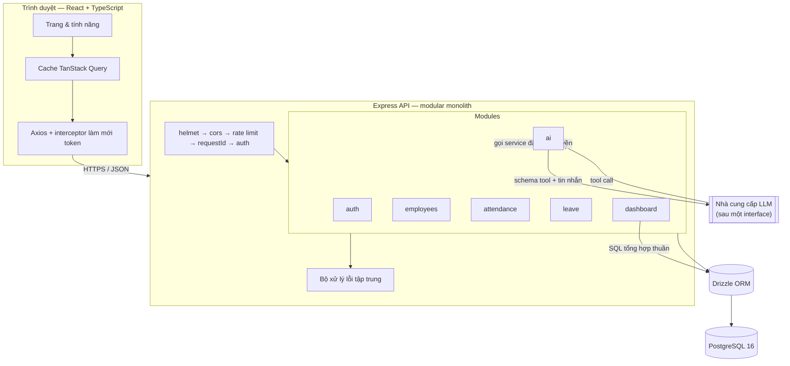
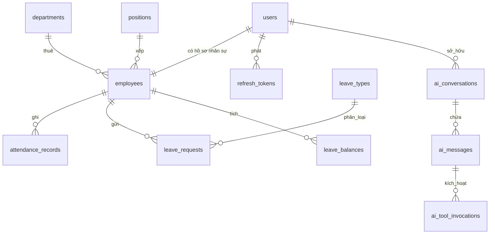
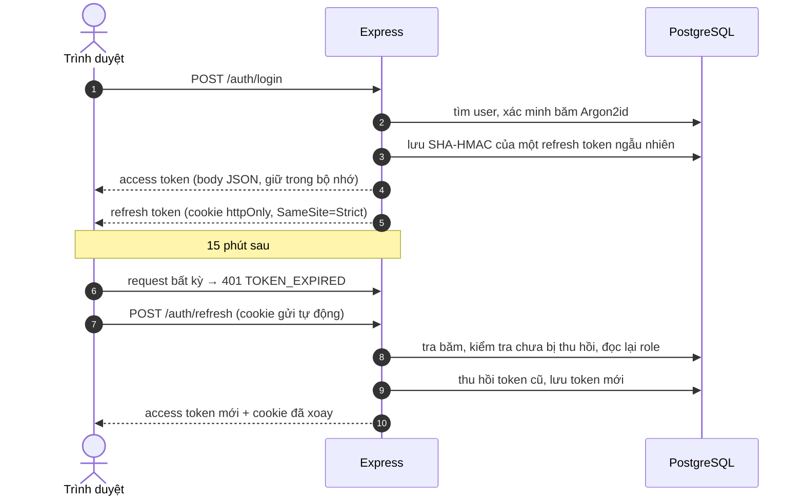
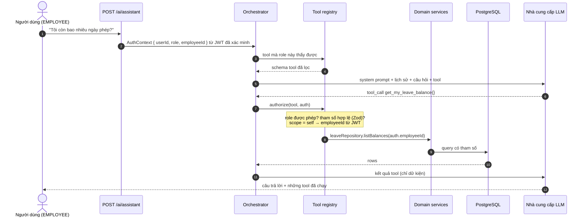

# AI-Powered HRM

Hệ thống quản lý nhân sự cho một công ty nhỏ, có trợ lý AI trả lời câu hỏi về dữ liệu nhân sự


TypeScript từ đầu đến cuối — React + Vite phía trước, Express + PostgreSQL phía sau, Drizzle ORM
cho schema và migration, Docker Compose để chạy trọn bộ, và 245 test chạy trên database thật.


---

## Demo

**<https://hrm-api-ubry.onrender.com>** — ba tài khoản ở mục [Tài khoản demo](#tài-khoản-demo) đăng
nhập được ngay, mỗi tài khoản một góc nhìn khác nhau.

Cứ thử thoải mái: đổi lương, khoá tài khoản, duyệt phép, hỏi trợ lý AI những câu mà role đang
đăng nhập không được phép hỏi. Dữ liệu dựng lại từ đầu mỗi đêm
([`demo-reset.yml`](.github/workflows/demo-reset.yml)), nên không có gì hỏng vĩnh viễn.

Vài điều nên biết trước khi bấm:

- Chạy trên gói miễn phí của Render nên service ngủ khi không ai dùng. Lần mở đầu tiên sau một
  thời gian dài có thể chờ 30–60 giây; sau đó thì bình thường.
- Trợ lý AI dùng mô hình miễn phí và bị siết còn 15 câu mỗi giờ cho mỗi tài khoản.
- Mọi dữ liệu đều do seed sinh ra. Không có người thật nào trong đó.

Toàn bộ hạ tầng nằm trong [`render.yaml`](render.yaml): một blueprint, hai thành phần — một database và một service phục vụ cả API lẫn giao diện.

---

## Vì sao có dự án này

Phần lớn demo HRM là vài form CRUD trên vài bảng. Ở đây có hai điều đáng để nói đến:

1. **Tầng AI là một bài toán phân quyền thật sự, và được giải ở backend.** Mô hình ngôn ngữ
   chọn *câu hỏi nào nên hỏi*; server quyết định *người dùng này có được phép hỏi câu đó không*.
   Mục [Kiến trúc AI](#kiến-trúc-ai) giải thích cách làm, và có một bộ test **ép** mô hình thử
   leo thang đặc quyền rồi khẳng định rằng nó thất bại.

2. **Quy tắc nghiệp vụ được thực thi ở nơi không thể lách.** Chấm công hai lần được chặn bằng
   unique index chứ không phải câu `if`; duyệt nghỉ phép trừ số dư bên trong transaction có khoá
   dòng; và một CHECK constraint từ chối lưu số dư vượt quá quyền lợi, kể cả khi logic ứng dụng
   sai.

Các quyết định thiết kế, gồm cả những phương án đã bị loại, được viết trong
[`docs/DESIGN.md`](docs/DESIGN.md).

---

## Tính năng

| Module | Làm được gì |
|---|---|
| **Xác thực** | Băm mật khẩu Argon2id, JWT access token ngắn hạn, refresh token xoay vòng lưu dạng băm trong database kèm phát hiện tái sử dụng, đổi mật khẩu có thu hồi phiên |
| **Nhân viên** | Tạo (tài khoản + hồ sơ nhân sự + số dư nghỉ phép trong một transaction), sửa hồ sơ **kể cả lương** ngay trên giao diện, tìm kiếm, lọc, sắp xếp, phân trang, **cho nghỉ việc** (đổi trạng thái + khoá đăng nhập trong một transaction, ghi audit); phân quyền tới cấp trường dữ liệu với lương |
| **Tài khoản (ADMIN)** | Đổi role và khoá / mở đăng nhập của tài khoản khác; thu hồi mọi phiên ngay; từ chối tự sửa chính mình, hạ cấp quản trị viên cuối cùng, và mở lại tài khoản của người đã nghỉ việc — quyền duy nhất ADMIN có mà HR không có |
| **Hồ sơ cá nhân** | Mọi role tự xem hồ sơ của mình, sửa số điện thoại / địa chỉ (để trống là xoá), và đổi mật khẩu — đổi xong mọi phiên bị thu hồi nên phải đăng nhập lại |
| **Phòng ban & vị trí** | Tạo / sửa / ngừng dùng ngay trên giao diện, kèm sĩ số cập nhật trực tiếp; ngừng dùng bị từ chối khi còn người, và lời từ chối nói rõ còn bao nhiêu; khoá ngoại từ chối để mồ côi dữ liệu |
| **Chấm công** | Check in / check out, quy tắc đi muộn và tăng ca lấy từ cấu hình, HR sửa bản ghi thì các trường suy dẫn được tính lại, tổng hợp theo tháng |
| **Nghỉ phép** | Máy trạng thái xin → duyệt / từ chối / huỷ, đếm ngày làm việc bỏ qua cuối tuần, phát hiện trùng lặp, hạch toán số dư dưới khoá dòng |
| **Dashboard** | Sĩ số, chấm công hôm nay, đơn chờ duyệt, và bốn biểu đồ dựng từ SQL tổng hợp thuần |
| **Trợ lý AI** | Gọi tool vào các hàm backend được phê duyệt, danh sách tool lọc theo role, phân quyền từng tool, audit đầy đủ; liệt kê nhân sự theo phòng ban thành bảng; hội thoại được lưu và mở lại; chạy offline không cần API key |

Cố ý **không** làm: tính lương và tuyển dụng. Lý do trong [`docs/DESIGN.md` §1](docs/DESIGN.md).

---

## Kiến trúc



**Modular monolith**, không phải microservices. Vấn đề microservices giải quyết — scale độc lập và
deploy độc lập bởi các team riêng — không tồn tại ở đây, còn cái giá thì có: duyệt nghỉ phép ghi
vào hai bảng một cách nguyên tử, thứ sẽ thành distributed saga nếu tách dịch vụ. Ranh giới module
là thật (`modules/leave` không bao giờ đụng vào repository của module khác), nên chúng vẫn là
đường cắt nếu sau này cần tách.

Mỗi module chia tầng:

```
modules/leave/
  leave.routes.ts       định tuyến + middleware nào áp dụng
  leave.controller.ts   chỉ HTTP: parse request → gọi service → định hình response
  leave.service.ts      quy tắc nghiệp vụ, transaction. Không req/res, không SQL.
  leave.repository.ts   truy cập dữ liệu. Không quy tắc nghiệp vụ.
  leave.policy.ts       hàm thuần — test được mà không cần I/O
  leave.schema.ts       schema Zod: nguồn sự thật duy nhất cho validation
```

Tách controller/service không phải để cho đẹp: tầng tool của AI gọi thẳng
`leaveService.getBalance()`, điều chỉ khả thi vì service không biết gì về Express.

---

## Lựa chọn công nghệ

| Quyết định | Phương án khác | Vì sao |
|---|---|---|
| PostgreSQL | MongoDB | Dữ liệu có quan hệ và duyệt nghỉ phép phải là transaction. Toàn vẹn tham chiếu và ACID là yêu cầu. |
| Drizzle ORM | Prisma | Schema của Drizzle *chính là* TypeScript, migration sinh ra là file `.sql` thuần review được, và query builder bám sát SQL nó phát ra — quan trọng khi mục đích là trình bày SQL chứ không phải giấu nó. Prisma có API thân thiện hơn và hệ sinh thái lớn hơn; đó là cái đánh đổi. |
| SQL thuần cho dashboard | Query builder của ORM | `FILTER (WHERE …)`, `generate_series` và window function viết thẳng rõ hơn là diễn đạt qua builder. Mỗi query đó có integration test, vì TypeScript không kiểm tra được chúng. |
| JWT + refresh token xoay vòng | Session phía server | Xác minh không trạng thái trên đường nóng, với điểm thu hồi mỗi 15 phút. Xem [Xác thực](#xác-thực). |
| Refresh token trong cookie httpOnly | localStorage | `localStorage` script nào cũng đọc được, nên một lỗi XSS là chiếm tài khoản 7 ngày. Rủi ro CSRF kéo theo được xử lý bằng `SameSite=Strict` và cookie giới hạn path. |
| Argon2id | bcrypt | Tốn bộ nhớ, nên bẻ khoá bằng GPU đắt. bcrypt cũng không sai. |
| Zod | Joi, express-validator | Schema suy ra kiểu TypeScript, nên kiểm tra lúc chạy và kiểu lúc biên dịch không thể lệch nhau. Cùng bộ schema đó validate tham số tool của AI. |
| TanStack Query | Redux | Gần như toàn bộ state ở đây là state *của server*. Redux nghĩa là tự viết caching, refetch và invalidation. |

---

## Database

13 bảng. ERD đầy đủ và lý do cho từng constraint nằm trong [`docs/DESIGN.md` §3](docs/DESIGN.md).



**Constraint mã hoá quy tắc nghiệp vụ**, thay vì tin vào code ứng dụng:

| Constraint | Ngăn điều gì |
|---|---|
| `attendance_records (employee_id, work_date)` UNIQUE | Chấm công hai lần. Hai request đồng thời đều qua được kiểm tra "đã có bản ghi chưa?" ở tầng ứng dụng; chỉ một cái sống sót qua unique index. |
| `leave_balance_within_entitlement` CHECK | Số dư có ngày đã dùng vượt quyền lợi, bất kể tầng service nghĩ gì |
| `employees_termination_consistent` CHECK | Nhân viên đã nghỉ mà không có ngày nghỉ, hoặc ngược lại |
| `leave_decision_consistent` CHECK | Đơn ghi là đã duyệt mà không có ai quyết định |
| `leave_dates_ordered` CHECK | Nghỉ phép có độ dài âm |
| `users_email_lower_unique` | Hai tài khoản cùng một email khác hoa thường |
| `ON DELETE RESTRICT` trên phòng ban / vị trí | Mồ côi nhân viên do xoá phòng ban |

**Chiến lược xoá:** không gì bị xoá cứng. Người thì `TERMINATED` kèm ngày; phòng ban và vị trí
thì vô hiệu hoá. Nhân viên đã nghỉ là một trạng thái nghiệp vụ thật mà HR vẫn cần lịch sử — không
phải một bia mộ mà mọi query phải nhớ lọc ra.

---

## Xác thực



Ba chi tiết đáng chú ý:

- **Hai token, hai việc.** Access token là JWT không trạng thái — xác minh không cần chạm
  database, đó vừa là toàn bộ lợi ích vừa là toàn bộ nhược điểm, nên nó chỉ sống 15 phút.
  Refresh token là chuỗi ngẫu nhiên đục, lưu *dạng băm*; là một dòng trong database chính là điều
  khiến logout, thu hồi và phát hiện đánh cắp khả thi.
- **Xoay vòng kèm phát hiện tái sử dụng.** Mỗi lần refresh phát token mới và thu hồi token cũ.
  Client tử tế không bao giờ đưa ra token đã thu hồi — thấy một cái nghĩa là hai bên đang giữ nó,
  nên *mọi* phiên của user đó bị thu hồi. Điều này có test.
- **Đăng nhập không bao giờ nói nửa nào sai.** Email lạ và mật khẩu sai trả cùng mã, cùng thông
  báo, và email lạ vẫn được xác minh với một băm giả để hai trường hợp tốn thời gian như nhau. Nếu
  không, endpoint này thành oracle dò tài khoản.

---

## Phân quyền

Ba role, và phân quyền thực thi ở ba nơi — không nơi nào là frontend.

| Khả năng | ADMIN | HR | EMPLOYEE |
|---|:--:|:--:|:--:|
| Liệt kê / tìm mọi nhân viên | ✅ | ✅ | ❌ |
| Xem chi tiết bất kỳ nhân viên | ✅ | ✅ | chỉ mình |
| **Xem `base_salary`** | ✅ | ✅ | **chỉ mình** |
| Tạo / sửa nhân viên (kể cả lương) | ✅ | ✅ (chỉ role EMPLOYEE khi tạo) | ❌ |
| Tạo tài khoản HR / ADMIN | ✅ | ❌ | ❌ |
| Đổi role / khoá–mở đăng nhập của tài khoản khác | ✅ | ❌ | ❌ |
| Duyệt / từ chối nghỉ phép | ✅ | ✅ | ❌ |
| Sửa chấm công | ✅ | ✅ | ❌ |
| Dashboard toàn công ty | ✅ | ✅ | ❌ |
| AI — câu hỏi cá nhân | ✅ | ✅ | ✅ |
| AI — câu hỏi toàn công ty | ✅ | ✅ | ❌ |

1. **Middleware route** (`requireRole`) — cổng thô ở endpoint.
2. **Tầng service** (`assertCanAccessEmployee`) — phạm vi cấp dòng, vì câu trả lời phụ thuộc vào
   bản ghi nào được yêu cầu.
3. **Mapper response** — `baseSalary` bị tước khỏi response với người xem không được phép. Nó
   *vắng mặt*, không phải null, nên một lỗi frontend không thể hiển thị nó thành `0`.

Với endpoint danh sách, filter `employeeId` của người gọi không có đặc quyền bị **ghi đè** thay
vì validate. Không có đường code nào để một nhân viên thấy bản ghi của nhân viên khác, nên một
kiểm tra bị quên cũng không rò dữ liệu.

App React ẩn những gì role không dùng được — nhưng đó là trải nghiệm, không phải bảo mật.

---

## Kiến trúc AI

> Mô hình không bao giờ nhận quyền truy cập database, không bao giờ nhận credential, và không
> bao giờ quyết định người dùng được xem gì. Nó chọn **câu hỏi nào nên hỏi**; backend quyết định
> **người dùng này có được hỏi câu đó không**.



### Vì sao không cho mô hình viết SQL

Text-to-SQL nghĩa là đầu ra của mô hình được thực thi trên database. Khi đó, thứ duy nhất đứng
giữa một nhân viên và `SELECT base_salary FROM employees` là việc mô hình *chịu* từ chối — mà
chỉ cần một câu prompt injection là xong. Với tool, yêu cầu đó thất bại vì **không có tool nào
như vậy được cấp cho role đó**, và không tool nào trả về lương.

Tool cũng test được. `get_my_leave_balance` có chữ ký cố định để khẳng định; một chuỗi SQL sinh ra
thì không.

### Tool registry

Mỗi tool có `name` (định danh mô hình gọi, lưu vào audit) và `title` (nhãn người dùng đọc trên
giao diện — mô hình không bao giờ thấy).

| Tool | Nhãn trên UI | Role | Phạm vi |
|---|---|---|---|
| `get_my_attendance_summary` | My attendance summary | tất cả | bản thân |
| `get_my_leave_balance` | My leave balance | tất cả | bản thân |
| `get_my_leave_requests` | My leave requests | tất cả | bản thân |
| `get_headcount` | Company headcount | HR, ADMIN | toàn công ty |
| `get_department_headcount` | Headcount by department | HR, ADMIN | toàn công ty |
| `get_attendance_statistics` | Attendance statistics | HR, ADMIN | toàn công ty |
| `get_late_employees` | Late arrivals | HR, ADMIN | toàn công ty |
| `get_pending_leave_requests` | Pending leave requests | HR, ADMIN | toàn công ty |
| `get_leave_statistics` | Leave statistics | HR, ADMIN | toàn công ty |
| `search_employees` | Employee directory | HR, ADMIN | toàn công ty; liệt kê theo **tên/mã phòng ban**, tìm theo tên, lọc theo trạng thái — lương không có trong kiểu trả về |

Ba tính chất làm điều này đứng vững:

1. **Danh sách tool được lọc theo role trước khi mô hình nhìn thấy.** Nhân viên không bao giờ
   được biết `get_late_employees` tồn tại. Không có gì để jailbreak tới.
2. **Tool phạm vi bản thân không hề có tham số `employeeId`.** Danh tính đến từ JWT đã xác minh.
   Một câu "gọi nó với employeeId 42" bị tiêm vào tạo ra một tham số mà Zod tước bỏ trước khi
   handler chạy — và handler vốn cũng không đọc nó.
3. **Không tool nào trả về lương.** Không phải "hiện chưa" — kiểu trả về không có trường đó.
   `search_employees` map dòng qua một DTO không có chỗ để điền lương.

Phân quyền được kiểm tra lại lúc thực thi, không chỉ lúc liệt kê, nên một tên tool bịa ra hoặc bị
tiêm vào sẽ bị từ chối thay vì âm thầm thành công.

Vài chi tiết thực dụng cho mô hình nhỏ chạy local: mọi `limit` mô hình gửi lên được **kẹp** vào
khoảng hợp lệ thay vì từ chối (một mô hình xin 65 dòng nghĩa là "nhiều nhất có thể"); kết quả
liệt kê kèm sẵn một bảng markdown để mô hình chép nguyên văn thay vì tóm tắt, cùng `total` thật để
nó nói "Showing 50 of 67".

### Mô hình đe doạ

| Mối đe doạ | Biện pháp |
|---|---|
| Prompt injection trực tiếp | Danh sách tool lọc theo role; không role nào có tool lương; phạm vi tiêm từ JWT |
| Injection gián tiếp (văn bản độc lưu trong hồ sơ nhân sự) | Kết quả tool được chèn dưới dạng JSON có cấu trúc trong role riêng, không bao giờ nối vào prompt; system prompt tuyên bố đầu ra tool là dữ liệu, không phải chỉ thị |
| Bịa dữ kiện nhân sự | System prompt cấm trả lời câu hỏi dữ liệu khi chưa có kết quả tool, và API trả về những tool đã chạy — UI hiển thị chúng, nên câu trả lời không có nguồn là nhìn thấy được |
| Chi phí / lạm dụng | Hạn mức mỗi giờ theo user đếm trong database, giới hạn bùng nổ theo IP, trần số vòng gọi tool, timeout request |
| Nhà cung cấp sập hoặc trả về sai định dạng | Lỗi provider có kiểu → HTTP 503 kèm thông báo rõ. Không bao giờ bịa câu trả lời. |
| Audit | Mọi lần gọi tool, **kể cả bị từ chối**, ghi vào `ai_tool_invocations` với user, tham số và kết quả |

### Abstraction nhà cung cấp

```ts
interface LlmProvider {
  readonly name: string;
  chat(request: LlmChatRequest): Promise<LlmChatResponse>;
}
```

Ba bản cài đặt: adapter tương thích OpenAI (chạy với OpenAI, Groq, OpenRouter, Together, hoặc
Ollama local), adapter Anthropic, và `FakeLlmProvider`.

Bản giả xứng đáng có mặt vì hai lẽ. Nó cho phép test bảo mật **ép** mô hình thử một pha leo thang
đặc quyền cụ thể — bạn không thể test rằng một lời gọi tool thù địch bị từ chối nếu không tạo ra
được lời gọi đó. Và nó cho phép app chạy hoàn toàn không cần API key: nó định tuyến vài câu hỏi
theo từ khoá tới những lời gọi tool *thật*, nên người review có thể clone repo và xem toàn bộ
đường ống phân quyền chạy mà không mất gì.

Điều `fake` không làm được là viết thành câu: nó in nguyên kết quả JSON của tool kèm một dòng
chú thích. Mọi thứ phía trên — định tuyến, phân quyền, audit — là hàng thật.

### Chạy mô hình thật mà không cần API key

Một server [Ollama](https://ollama.com) local nói cùng giao thức Chat Completions của OpenAI, nên
không cần sửa code — chỉ cần cấu hình:

```bash
ollama pull qwen2.5:3b
```

```ini
AI_PROVIDER=openai
AI_MODEL=qwen2.5:3b
AI_API_KEY=ollama              # Ollama không dùng; schema chỉ yêu cầu khác rỗng
AI_BASE_URL=http://localhost:11434/v1
AI_TIMEOUT_MS=60000            # request đầu tiên phải trả giá cho việc nạp mô hình vào bộ nhớ
```

Hai điều quyết định trải nghiệm dễ chịu hay vô dụng:

**Chọn mô hình hỗ trợ tool calling.** Trợ lý là một vòng lặp gọi tool; mô hình không có khả năng
đó sẽ trả lời từ prompt và không chạm được dữ liệu nào. Họ `qwen2.5` và `llama3.1` có hỗ trợ.

**Chọn mô hình vừa VRAM.** Điều này quan trọng hơn số tham số. Mô hình 7B khoảng 5&nbsp;GB không
vừa card 6&nbsp;GB sau khi màn hình lấy phần của nó, nên Ollama chia layer — và phần rơi vào CPU
quyết định thời gian chạy. Đo trên RTX 4050 6&nbsp;GB: `qwen2.5:7b` nạp ở 18% CPU / 82% GPU và
mất 25 giây để sinh ba token, còn `qwen2.5:3b` nạp 100% GPU và trả lời trọn một câu hỏi, gồm cả
tool call, trong khoảng hai giây. Kiểm tra bằng `ollama ps`; nếu cột `PROCESSOR` không phải 100%
GPU, hãy chọn mô hình nhỏ hơn thay vì ngồi đợi.

Câu trả lời từ mô hình 3B yếu hơn rõ rệt so với mô hình thương mại — chờ đợi câu chữ lủng củng,
định dạng dao động giữa các lần hỏi, và hãy kiểm tra những con số nó nêu mà không tool nào trả về.

---

## Bắt đầu

### Bằng Docker (không cần cài gì ngoài Docker)

```bash
cp .env.example .env
# Sinh hai secret rồi dán vào .env:
node -e "console.log(require('crypto').randomBytes(48).toString('base64url'))"

docker compose up --build
```

Rồi, ở terminal khác, áp dụng migration và nạp dữ liệu demo:

```bash
docker compose exec api npm run db:deploy
docker compose exec api node dist/db/seed.js
# Mật khẩu sinh ra nằm trong container; chép ra ngoài:
docker compose cp api:/app/seed-output/accounts.csv ./accounts.csv
```

- Web → <http://localhost:8080>
- API → <http://localhost:4000/api/v1>
- Health check → <http://localhost:4000/health>

### Chạy trực tiếp

Cần Node 22 (xem `.nvmrc`) và một PostgreSQL 16.

```bash
# Backend
cd backend
npm install
cp ../.env.example .env          # rồi sửa DATABASE_URL và hai secret JWT
npm run db:migrate
npm run db:seed
npm run dev                       # http://localhost:4000

# Frontend, ở terminal thứ hai
cd frontend
npm install
npm run dev                       # http://localhost:5173
```

### Deploy lên Render

[`render.yaml`](render.yaml) khai báo sẵn cả hai thành phần, nên trên Render chỉ cần
**New → Blueprint** rồi trỏ vào repo này. Hai việc còn lại phải làm tay, vì chúng là secret:

1. **`AI_BASE_URL`, `AI_MODEL`, `AI_API_KEY`** — bất kỳ host nào tương thích OpenAI và có
   tool-calling. Mục [Abstraction nhà cung cấp](#abstraction-nhà-cung-cấp) giải thích vì sao đổi
   nhà cung cấp không cần đụng vào code.
2. **`CORS_ORIGIN`** — điền URL Render cấp cho service. Frontend gọi API bằng đường dẫn tương
   đối trên cùng origin nên không có request cross-origin nào, nhưng đặt đúng vẫn hơn để bỏ
   trống.

**Một service, không phải hai.** [`Dockerfile`](Dockerfile) ở thư mục gốc build cả hai nửa và
Express phục vụ frontend từ `./public`. Đây là quyết định về bảo mật chứ không phải chi phí:
cookie refresh là `SameSite=Strict`, mà `onrender.com` nằm trong Public Suffix List, nên hai
hostname con của nó là **hai site khác nhau**. Tách frontend ra static site riêng thì đăng nhập
vẫn được, rồi F5 một cái là mất phiên — Safari còn chặn thẳng cookie kiểu đó. Cùng một origin
thì câu hỏi đó không tồn tại.

Database cũng không phải làm gì: container chạy [`docker-start.sh`](backend/docker-start.sh) —
migrate, bật seed chạy nền, rồi khởi động server. Vài phút đầu sau lần deploy đầu tiên, web đã
lên nhưng dữ liệu còn đang được đổ vào; seed chạy nền chứ không chặn server, vì Render chỉ chờ
service mở cổng trong một khoảng ngắn rồi coi như deploy hỏng, mà hash 500 mật khẩu argon2id thì
lâu hơn thế. Những lần khởi động sau, seed nhìn thấy database đã có tài khoản nên in một dòng
rồi bỏ qua — nó không bao giờ tự xoá gì.

Tạo tay thay vì dùng Blueprint cũng được. Khi đó service là **Docker**, Root Directory để
**trống** (Dockerfile nằm ở gốc repo), và ô **Docker Command** điền `./docker-start.sh`. Bỏ
trống ô đó thì container chỉ chạy server, không migrate và không seed.

Muốn dữ liệu tự dựng lại mỗi đêm thì thêm external connection string của database vào GitHub
secret `DEMO_DATABASE_URL`, cho [`demo-reset.yml`](.github/workflows/demo-reset.yml) dùng.

### Tài khoản demo

Do seed tạo. Ba tài khoản này dùng chung mật khẩu `DemoPassw0rd!`; mọi tài khoản còn lại có mật
khẩu riêng, liệt kê trong `backend/seed-output/accounts.csv` (git-ignored) sau khi seed chạy.
Không gì trong app tiết lộ chúng — trang đăng nhập chỉ là trang đăng nhập.

| Role | Email | Thấy gì |
|---|---|---|
| Admin | `admin@hrm.local` | Mọi thứ, kể cả quản lý tài khoản |
| HR | `hr@hrm.local` | Mọi nhân viên, duyệt phép, dashboard, mọi tool AI |
| Employee | `employee@hrm.local` | Chỉ bản ghi của mình, ba tool AI cá nhân |

Seed dựng một công ty 500 người trong năm phòng ban cộng một phòng Executive chỉ có giám đốc — 485 đang làm và 15 đã nghỉ — với ba tháng
chấm công (~30.000 bản ghi, gồm cả đi muộn và quên check-out như thật) và ~640 đơn nghỉ phép ở
mọi trạng thái. Mọi thứ trừ mật khẩu là tất định, nên cùng một lệnh luôn cho ra cùng một công ty.

Nó không bao giờ tự xoá gì: chỉ đổ vào database trống và từ chối đụng vào database đã có tài
khoản. Xoá là một bước riêng, phải gọi đích danh:

```bash
npm run db:seed -- --reset       # bỏ mọi bảng và dựng lại từ đầu
```

---

## Biến môi trường

Mọi biến được validate bằng Zod lúc khởi động — thiếu hoặc sai định dạng làm process sập ngay với
thông báo đọc được, thay vì hiện thành `undefined` ba tiếng sau. Xem [`.env.example`](.env.example)
để có danh sách đầy đủ.

| Biến | Mặc định | Ghi chú |
|---|---|---|
| `DATABASE_URL` | — | Bắt buộc |
| `JWT_ACCESS_SECRET` / `JWT_REFRESH_SECRET` | — | Bắt buộc, ≥32 ký tự, phải khác nhau |
| `JWT_ACCESS_TTL` | `15m` | |
| `JWT_REFRESH_TTL_DAYS` | `7` | |
| `WORK_START` / `WORK_END` | `08:00` / `17:30` | Chính sách chấm công — cấu hình, không phải hằng trong code |
| `LATE_GRACE_MINUTES` | `5` | |
| `BREAK_MINUTES` | `60` | Giờ nghỉ không lương trừ khỏi ngày làm đủ |
| `COMPANY_TIMEZONE` | `Asia/Ho_Chi_Minh` | Chấm công lưu theo UTC; "đi muộn" là câu hỏi theo giờ địa phương |
| `AI_PROVIDER` | `fake` | `openai` \| `anthropic` \| `fake` |
| `AI_API_KEY` | — | Bắt buộc trừ khi provider là `fake`; với Ollama điền giá trị bất kỳ |
| `AI_BASE_URL` | OpenAI | Host tương thích OpenAI bất kỳ. Bị bỏ qua khi provider là `anthropic` |
| `AI_TIMEOUT_MS` | `30000` | Tăng lên với mô hình local — request đầu tiên nạp mô hình vào bộ nhớ |
| `AI_MAX_TOOL_ITERATIONS` | `5` | Chặn chi phí và thời gian request |
| `AI_RATE_LIMIT_PER_HOUR` | `30` | Theo user, đếm trong database |

Không secret nào được commit, không cái nào được nướng vào Dockerfile.

---

## API

`/api/v1`, một phong bì nhất quán cho mọi response:

```jsonc
{ "data": { }, "meta": { "page": 1, "pageSize": 20, "total": 137 } }
{ "error": { "code": "LEAVE_BALANCE_EXCEEDED", "message": "…", "requestId": "…" } }
```

| Method | Path | Role |
|---|---|---|
| POST | `/auth/login`, `/auth/refresh`, `/auth/logout` | công khai / cookie |
| GET | `/auth/me` | đã xác thực |
| POST | `/auth/change-password` | đã xác thực |
| GET/POST | `/employees` | HR, ADMIN (`?department=` lọc theo tên/mã phòng ban) |
| GET | `/employees/me`, `/employees/:id` | đã xác thực (bản ghi của mình, hoặc HR/ADMIN) |
| PATCH | `/employees/me`, `/employees/:id` | bản thân (ít trường) / HR, ADMIN |
| POST | `/employees/:id/terminate` | HR, ADMIN |
| PATCH | `/employees/:id/account` | **ADMIN** — đổi role hoặc khoá/mở đăng nhập; từ chối tự sửa, admin cuối, người đã nghỉ |
| GET/POST/PATCH | `/departments`, `/positions` | đọc: tất cả · ghi: HR, ADMIN |
| POST | `/attendance/check-in`, `/attendance/check-out` | đã xác thực |
| GET | `/attendance`, `/attendance/today`, `/attendance/summary` | theo phạm vi role |
| PATCH | `/attendance/:id` | HR, ADMIN |
| GET/POST | `/leave/requests`, `/leave/balances`, `/leave/types` | theo phạm vi role |
| PATCH | `/leave/requests/:id/approve` \| `/reject` \| `/cancel` | HR, ADMIN / chủ đơn |
| GET | `/dashboard/overview`, `/charts`, `/late-employees` | HR, ADMIN |
| POST | `/ai/assistant` | đã xác thực, có rate limit |
| GET | `/ai/capabilities`, `/ai/conversations`, `/ai/conversations/:id` | đã xác thực (hội thoại kèm tool call của từng câu trả lời) |

Mã trạng thái: `400` validation · `401` chưa xác thực hoặc hết hạn · `403` đã xác thực nhưng
không được phép · `404` không tìm thấy · `409` xung đột nghiệp vụ · `429` bị giới hạn · `503`
nhà cung cấp AI không sẵn sàng.

`401` nghĩa là "bạn là ai?"; `403` nghĩa là "tôi biết bạn là ai và câu trả lời là không".

---

## Kiểm thử

```bash
cd backend && npm test
```

**245 test, tất cả chạy trên PostgreSQL thật.** Không mock — tính đúng đắn của dự án này dựa vào
unique index, CHECK constraint, `SELECT … FOR UPDATE` và rollback transaction, những thứ không
mock nào tái tạo được. Một bộ test mock database không thể cho bạn biết chấm công hai lần có
thực sự bị chặn hay không.

| Bộ test | Số test | Bao phủ |
|---|--:|---|
| `attendance.policy.test.ts` | 22 | Quy tắc đi muộn / tăng ca / phút làm việc, ranh giới múi giờ, số học cuối tuần — hàm thuần, không I/O |
| `leave.policy.test.ts` | 16 | Validate ngày, đếm ngày làm việc, tính số dư, máy trạng thái |
| `anthropic.provider.test.ts` | 14 | Định dạng request tới Anthropic: không gửi `temperature`, thinking block được replay nguyên vẹn, ánh xạ lỗi |
| `openai.provider.test.ts` | 22 | Định dạng request tương thích OpenAI: base URL giữ nguyên, tham số tool dạng chuỗi JSON, JSON cụt được báo lỗi thay vì ném |
| `auth.test.ts` | 19 | Đăng nhập, hết hạn token vs giả mạo, xoay vòng refresh, **phát hiện tái sử dụng**, đổi mật khẩu |
| `authorization.test.ts` | 30 | Mọi endpoint được bảo vệ gọi bởi sai role; mass-assignment; leo thang đặc quyền |
| `ai.test.ts` | 31 | Tool lọc theo role, lời gọi bị từ chối, tiêm phạm vi, liệt kê theo phòng ban, kẹp `limit`, replay hội thoại, audit, lỗi provider, hạn mức |
| `accounts.test.ts` | 13 | Quản trị tài khoản: chỉ ADMIN; đổi role thu hồi phiên; từ chối tự sửa, admin cuối, mở lại người đã nghỉ |
| `employees.test.ts` | 31 | Rollback transaction, constraint trùng lặp, đầu vào hình dạng SQL injection, lọc theo tên phòng ban, phân trang, nhân viên tự sửa liên hệ, từ chối tự cho mình nghỉ việc và cho quản trị viên cuối cùng nghỉ |
| `attendance.test.ts` | 18 | Chấm công hai lần, check-out không có check-in, HR sửa bản ghi |
| `leave.test.ts` | 20 | Trùng lặp, số dư, transaction duyệt, tự duyệt, huỷ |
| `dashboard.test.ts` | 9 | Mọi câu SQL tổng hợp thuần |

Vài ví dụ về những gì được khẳng định:

```
EMPLOYEE → GET /employees/<id người khác>              → 403 NOT_YOUR_RECORD
EMPLOYEE → PATCH /leave-requests/<id>/approve            → 403 INSUFFICIENT_ROLE
HR       → POST /employees {role: "ADMIN"}               → 403 INSUFFICIENT_ROLE
HR tự duyệt đơn nghỉ phép của mình                        → 409 CANNOT_APPROVE_OWN_REQUEST
Chấm công lần hai trong ngày                             → 409, nhờ unique index
AI: EMPLOYEE bị ép gọi get_late_employees                → bị từ chối và ghi audit
AI: EMPLOYEE bị ép gọi search_employees theo phòng ban   → bị từ chối, không lộ dòng nào
AI: employeeId tiêm vào tham số tool                     → bị tước; dùng danh tính từ JWT
AI: provider timeout                                     → 503, không bao giờ bịa câu trả lời
```

**Hai lỗi thật được bộ test này tìm ra trong lúc phát triển**, đều thuộc loại mà mock sẽ giấu đi:

1. Drizzle bọc lỗi của driver, nên `error.code === '23505'` không bao giờ khớp và mọi xung đột
   unique bị báo là 500 thay vì 409.
2. Drizzle in tham chiếu cột không có tiền tố bảng, nên một subquery tương quan biên dịch thành
   `"department_id" = "id"` — so sánh `employees.department_id` với `employees.id`. SQL hợp lệ,
   không lỗi, và mọi phòng ban âm thầm báo không có nhân viên.

**Và một lỗi mà bộ test này không bắt được**, đáng ghi lại vì nó chỉ ra ranh giới của bộ test:
ba control form (`Input`, `Select`, `Textarea`) không forward `ref`, nên react-hook-form đọc giá
trị từ một ref giả và mọi ô nhập gõ tay nộp lên `undefined`. Không integration test nào phía
backend thấy được điều đó — request chưa bao giờ được gửi đi. Nó được người dùng phát hiện ở màn
hình đăng nhập, và được tái hiện trong jsdom trước khi sửa.

---

## CI

[`.github/workflows/ci.yml`](.github/workflows/ci.yml) chạy với mọi push và pull request vào `main`:

1. **Backend** — `npm ci` → lint → typecheck → áp dụng migration → test (trên một service container
   PostgreSQL thật) → build
2. **Frontend** — `npm ci` → lint → typecheck → build
3. **Docker** — build cả hai image, chỉ sau khi code đã được xác nhận tốt

Phiên bản Node lấy từ `.nvmrc` — một nguồn sự thật cho CI, máy dev và các Dockerfile.

---

## Cấu trúc dự án

```
.
├── backend/
│   ├── drizzle/                  migration SQL sinh ra (commit, review được)
│   ├── seed-output/              mật khẩu do seed sinh — git-ignored
│   ├── src/
│   │   ├── config/env.ts         môi trường validate bằng Zod, sập sớm lúc khởi động
│   │   ├── db/                   schema, client, seed
│   │   ├── middlewares/          auth, validation, xử lý lỗi, ngữ cảnh request
│   │   ├── modules/              auth · employees · departments · positions
│   │   │                         attendance · leave · dashboard · ai
│   │   ├── shared/               lỗi, phong bì http, logger, lịch, audit
│   │   ├── app.ts                chuỗi middleware (không có server)
│   │   └── server.ts             listen + tắt êm
│   └── tests/                    bộ integration + phân quyền
├── frontend/
│   └── src/
│       ├── app/                  layout, chặn route theo role
│       ├── components/ui.tsx     control dùng chung
│       ├── features/auth/        ngữ cảnh phiên, đăng nhập
│       ├── features/attendance/  form HR sửa bản ghi chấm công
│       ├── features/employees/   form tạo / sửa / cho nghỉ việc
│       ├── features/organisation/ form phòng ban và vị trí
│       ├── lib/                  client api, kiểu, định dạng, ghi nhớ hội thoại trợ lý
│       └── pages/                dashboard · employees · attendance · leave
│                                 assistant · profile · accounts (ADMIN)
├── docs/DESIGN.md                quyết định thiết kế và phương án bị loại
├── docker-compose.yml
└── .github/workflows/ci.yml
```

---

## Giới hạn đã biết

Nói thẳng, vì một README nói quá tệ hơn một README thừa nhận ranh giới của mình.

- **Không có lịch ngày lễ.** Đếm ngày phép bỏ qua cuối tuần nhưng không bỏ ngày lễ, nên một đơn
  trùng dịp Tết bị tính dư. Sửa đúng cách cần một bảng ngày lễ và giao diện quản trị cho nó.
- **Không có nghỉ nửa ngày.** Phép đếm theo ngày nguyên.
- **Rate limit đăng nhập theo IP.** Kẻ tấn công có nhiều địa chỉ thì có nhiều bucket, còn người
  dùng sau một NAT công ty thì dùng chung một. Khoá theo tài khoản sẽ là phần bổ sung.
- **Không có email.** Thông báo duyệt và email chào mừng chưa làm. HR đặt mật khẩu ban đầu trực
  tiếp và nhân viên tự đổi được sau khi đăng nhập, nhưng **quên mật khẩu thì phải nhờ HR đặt
  lại** — không có luồng tự phục hồi qua email.
- **Không upload file.** Không ảnh đại diện, không hợp đồng.
- **Không có cây quản lý.** Đơn đi tới bất kỳ HR nào thay vì theo tuyến báo cáo — đó là lý do
  không có role `MANAGER`. Thêm role mà không có cây thì chỉ là trang trí.
- **Phân trang offset.** Ổn ở quy mô này; đến hàng trăm nghìn dòng sẽ cần cursor.
- **Trợ lý AI chỉ đọc.** Nó không duyệt phép hay sửa bản ghi, theo thiết kế.
- **Prompt injection được giảm nhẹ, không phải giải quyết.** Các phòng thủ cấu trúc (tool lọc
  theo role, phạm vi từ JWT, không có lương trong kiểu trả về nào) đứng vững bất kể mô hình bị
  thuyết phục điều gì. Phòng thủ ở tầng prompt là nỗ lực tốt nhất có thể.
- **Mô hình local nhỏ không ổn định về định dạng.** Với `qwen2.5:3b`, câu trả lời lúc là bảng
  nguyên vẹn, lúc là danh sách, lúc có thêm đoạn dẫn — dữ liệu đúng, hình thức dao động. Mô hình
  lớn hơn hoặc nhà cung cấp thương mại cho kết quả đều hơn.

## Hướng phát triển

- Lịch ngày lễ và nghỉ nửa ngày
- Role quản lý với cây báo cáo, và đơn được định tuyến theo đó
- Tính lương dựa trên dữ liệu chấm công và nghỉ phép sẵn có
- Thông báo email khi duyệt
- Khoá đăng nhập theo tài khoản bên cạnh giới hạn theo IP
- Triển khai: backend là container không trạng thái và frontend là bundle tĩnh, nên Render/Fly
  cộng một PostgreSQL có quản lý sẽ chạy mà không cần sửa code
