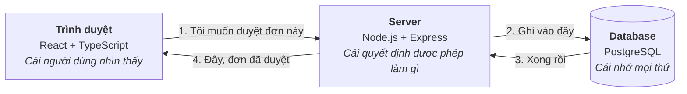
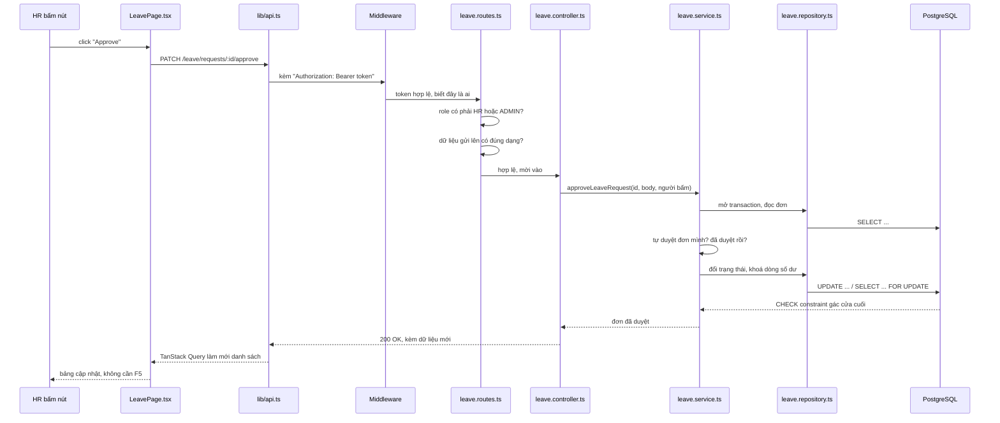
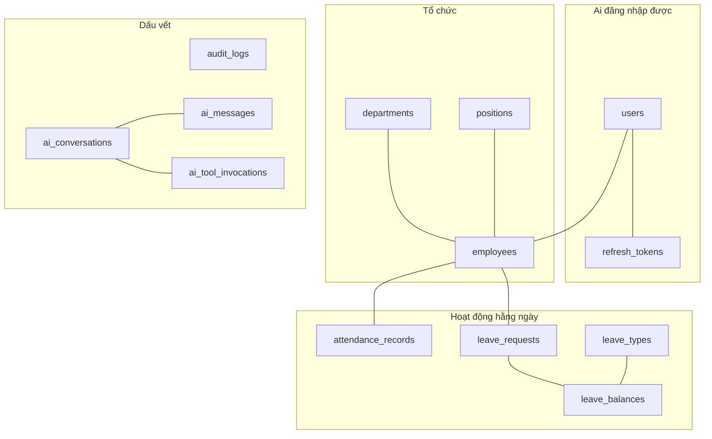
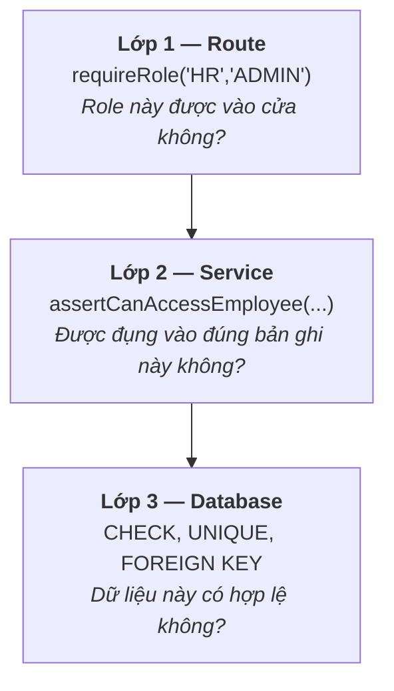
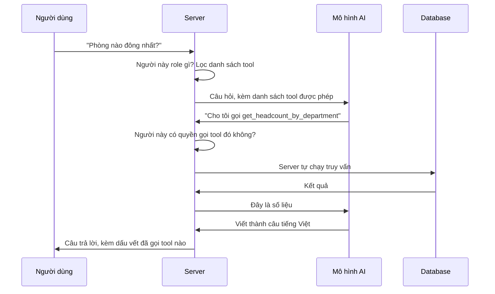

# Kiến trúc dự án, giải thích từ đầu

Tài liệu này dành cho người **mới biết lập trình sơ sơ**: bạn đã viết được vài trang web
nhỏ, biết hàm là gì, biết database dùng để lưu dữ liệu, nhưng chưa từng đọc một dự án
hoàn chỉnh nào. Mục tiêu là sau khi đọc xong, bạn mở bất kỳ file nào trong repo này ra
cũng biết **nó nằm ở đâu trong bức tranh chung và vì sao nó tồn tại**.

Không chỗ nào trong đây yêu cầu bạn biết trước thuật ngữ. Chữ nào lạ thì cuối file có
[Từ điển](#từ-điển-thuật-ngữ).

> Tài liệu này khác [`DESIGN.md`](DESIGN.md). File đó ghi lại **các quyết định thiết kế và
> những phương án đã bị loại** — viết cho người đã hiểu hệ thống. File bạn đang đọc giải
> thích **hệ thống là gì** — viết cho người chưa hiểu.

---

## 1. Dự án này làm gì

Một phần mềm quản lý nhân sự cho công ty nhỏ. Nó làm bốn nhóm việc:

- **Hồ sơ nhân viên** — thêm người, sửa thông tin, chỉnh lương, cho nghỉ việc
- **Chấm công** — check in, check out, tính đi muộn và tăng ca
- **Nghỉ phép** — nhân viên xin, HR duyệt hoặc từ chối, hệ thống trừ số ngày còn lại
- **Trợ lý AI** — hỏi bằng tiếng Việt, ví dụ *"phòng nào đông nhất?"*, và nhận câu trả lời
  lấy từ dữ liệu thật

Có ba loại người dùng, gọi là **role**: `EMPLOYEE` (nhân viên thường), `HR` (nhân sự) và
`ADMIN` (quản trị). Ai thấy được gì phụ thuộc vào role — và đó là một trong những phần thú
vị nhất của dự án, nói kỹ ở [mục 8](#8-phân-quyền-ba-lớp-khoá).

---

## 2. Ba mảnh lớn

Mọi ứng dụng web đều có ít nhất ba mảnh. Nếu bạn chỉ nhớ được một hình trong tài liệu này,
hãy nhớ hình dưới đây.



Ba mảnh này nằm ở ba thư mục:

| Mảnh | Thư mục | Ngôn ngữ |
|---|---|---|
| Trình duyệt | [`frontend/`](../frontend) | TypeScript + React |
| Server | [`backend/`](../backend) | TypeScript + Express |
| Database | Chạy trong Docker, cấu trúc mô tả ở [`schema.ts`](../backend/src/db/schema.ts) | PostgreSQL |

**Điều quan trọng nhất cần hiểu:** trình duyệt **không bao giờ** nói chuyện trực tiếp với
database. Mọi thứ phải đi qua server.

Vì sao? Vì code chạy trong trình duyệt thì người dùng sửa được — bấm F12 là thấy hết. Nếu
trình duyệt được ra lệnh thẳng cho database, bất kỳ ai cũng có thể tự tăng lương cho mình.
Server là nơi duy nhất kiểm tra được "người này có được phép làm việc này không", vì người
dùng không với tới code của nó.

---

## 3. Đi theo một cú bấm chuột

Đây là phần đáng đọc kỹ nhất. Ta sẽ theo chân **một** hành động — HR bấm nút **Approve**
trên một đơn nghỉ phép — đi hết hệ thống, qua từng file thật.



Giờ đi chậm lại từng chặng.

### Chặng 1 — Trình duyệt gửi đi

Người dùng bấm nút trong [`LeavePage.tsx`](../frontend/src/pages/LeavePage.tsx). Trang này
không tự gửi request; nó gọi qua [`lib/api.ts`](../frontend/src/lib/api.ts) — một file duy
nhất lo mọi việc nói chuyện với server. Nhờ vậy, muốn đổi địa chỉ server hay thêm header
thì sửa **một chỗ** thay vì sửa tám trang.

`api.ts` tự gắn vào mỗi request một dòng:

```
Authorization: Bearer eyJhbGciOi...
```

Đó là **access token** — tấm thẻ chứng minh "tôi là ai". Giải thích ở
[mục 7](#7-đăng-nhập-hoạt-động-thế-nào).

### Chặng 2 — Server kiểm tra trước khi cho vào

Request đến server và đi qua một dãy **middleware** — những hàm xếp hàng, mỗi hàm xem qua
request rồi quyết định cho đi tiếp hay chặn lại. Thứ tự khai báo trong
[`app.ts`](../backend/src/app.ts), và **thứ tự đó có chủ ý**:

| # | Middleware | Làm gì |
|---|---|---|
| 1 | `requestId` | Gắn mã định danh cho request, để log sau này lần ra được |
| 2 | `helmet` | Thêm các header bảo mật |
| 3 | `cors` | Quyết định trang web nào được phép gọi API này |
| 4 | `express.json` | Đọc phần thân request từ chuỗi JSON thành object |
| 5 | `rateLimit` | Chặn nếu một người gọi quá nhiều lần |
| 6 | routes | Tới đây mới là code nghiệp vụ |
| 7 | `errorHandler` | Bắt mọi lỗi rơi ra từ phía trên |

Ví dụ vì sao thứ tự quan trọng: `express.json` phải đứng **trước** routes, không thì lúc
controller đọc `req.body` nó thấy `undefined`. Còn `errorHandler` phải đứng **cuối cùng**,
vì Express chỉ tìm hàm xử lý lỗi trong những hàm đăng ký *sau* chỗ phát sinh lỗi.

### Chặng 3 — Route quyết định ai được vào

[`leave.routes.ts`](../backend/src/modules/leave/leave.routes.ts):

```ts
leaveRouter.patch(
  '/requests/:id/approve',
  requireRole('HR', 'ADMIN'),                                         // (a)
  validate({ params: uuidParam(), body: approveLeaveRequestSchema }), // (b)
  asyncHandler(controller.approve),                                   // (c)
);
```

- **(a)** `requireRole` — nhân viên thường gọi vào đây bị trả lỗi 403 ngay, controller không
  bao giờ chạy.
- **(b)** `validate` — kiểm tra `:id` có đúng định dạng UUID không, phần thân có đúng cấu
  trúc không. Sai thì trả 400 kèm mô tả. Nhờ bước này, **controller không bao giờ phải tự
  hỏi "dữ liệu này có hợp lệ không"** — tới được đó nghĩa là đã hợp lệ.
- **(c)** `asyncHandler` — một bọc nhỏ: hàm bên trong ném lỗi thì lỗi được chuyển đúng cho
  `errorHandler` thay vì làm sập server. Đây là cái bẫy kinh điển của Express với hàm async.

### Chặng 4 — Ba tầng của backend

Đây là chỗ nhiều người mới thấy rối: *sao một việc lại phải qua ba file?* Hình dung một nhà
hàng:

| Tầng | File | Vai trong nhà hàng | Biết gì, không biết gì |
|---|---|---|---|
| **Controller** | `leave.controller.ts` | Người phục vụ | Biết cách nói chuyện với khách (HTTP). **Không** biết nấu ăn. |
| **Service** | `leave.service.ts` | Đầu bếp | Biết công thức và mọi quy tắc. **Không** biết khách ngồi bàn nào. |
| **Repository** | `leave.repository.ts` | Người giữ kho | Biết nguyên liệu nằm ở đâu (SQL). **Không** biết đang nấu món gì. |

Controller ngắn đến mức gần như buồn cười — và đó là dấu hiệu tốt:

```ts
export async function approve(req: Request, res: Response): Promise<void> {
  sendData(
    res,
    await service.approveLeaveRequest(
      req.params.id as string,
      req.body as ApproveLeaveRequestInput,
      getAuth(req),
    ),
  );
}
```

Đó là toàn bộ hàm, chép nguyên từ file. Nó đọc request, gọi đầu bếp, trả lời. Hết.

**Vì sao phải tách?** Ba lý do rất cụ thể:

1. **Test được.** Muốn kiểm tra quy tắc "không ai được tự duyệt đơn của mình", ta gọi thẳng
   hàm service, không cần dựng server HTTP.
2. **Dùng lại được.** Trợ lý AI cũng cần đọc dữ liệu nhân sự. Nó gọi vào **service**, nên tự
   động thừa hưởng mọi quy tắc phân quyền. Nếu logic nằm trong controller, tầng AI phải chép
   lại — và bản chép sẽ lệch đi theo thời gian.
3. **Đổi được.** Mai sau muốn đổi PostgreSQL sang thứ khác, chỉ repository phải viết lại.

### Chặng 5 — Service làm việc thật

[`approveLeaveRequest`](../backend/src/modules/leave/leave.service.ts) mở một **transaction**
rồi làm bốn việc:

1. Đọc đơn ra. Không có thì báo 404.
2. **Từ chối nếu người bấm chính là chủ đơn.** Luật này *không* đặt được ở `requireRole`, vì
   HR cũng có nghỉ phép — vấn đề không phải role, mà là quan hệ giữa người bấm và đơn cụ thể
   đó. Loại luật này luôn thuộc về service.
3. Đổi trạng thái sang `APPROVED`. Nếu câu lệnh cập nhật **0 dòng**, nghĩa là người khác vừa
   duyệt xong trong tích tắc vừa rồi — báo 409.
4. **Khoá dòng số dư** (`SELECT ... FOR UPDATE`) rồi trừ số ngày.

Bước 4 giải quyết một tình huống rất dễ bỏ sót. Giả sử hai HR cùng bấm duyệt hai đơn của
cùng một người, cùng lúc:

```
KHÔNG khoá dòng:                      CÓ khoá dòng:
  HR-A đọc: còn 3 ngày                  HR-A khoá dòng, đọc: còn 3 ngày
  HR-B đọc: còn 3 ngày                  HR-B đợi...
  HR-A ghi: còn 1                       HR-A ghi: còn 1, nhả khoá
  HR-B ghi: còn 1   ← SAI               HR-B đọc: còn 1 → không đủ, từ chối
```

Bên trái, người đó nghỉ 4 ngày nhưng hệ thống chỉ trừ 2. Khoá dòng bắt HR-B xếp hàng.

### Chặng 6 — Database gác cửa cuối cùng

Ngay cả khi toàn bộ đoạn trên viết sai, PostgreSQL vẫn từ chối lưu dữ liệu vô lý, nhờ dòng
này trong [`schema.ts`](../backend/src/db/schema.ts):

```ts
check('leave_balance_within_entitlement',
  sql`${t.usedDays} >= 0 AND ${t.usedDays} <= ${t.entitledDays}`)
```

Đây là **CHECK constraint** — luật do chính database giữ. Không code nào lách được, kể cả
người vào sửa tay bằng SQL.

Cùng tinh thần đó, chấm công hai lần trong một ngày bị chặn bằng **unique index** chứ không
phải bằng câu `if`:

```ts
uniqueIndex('attendance_employee_date_unique').on(t.employeeId, t.workDate)
```

**Vì sao không dùng `if`?** Vì giữa lúc `if` kiểm tra và lúc ghi vào, một request khác có
thể chen vào giữa. Unique index không có khe hở đó — database **đảm bảo**, chứ không phải
ta hy vọng.

### Chặng 7 — Đường về

Service trả kết quả → controller gói thành JSON → trình duyệt nhận. Trong `LeavePage.tsx`,
**TanStack Query** được báo rằng danh sách đơn đã cũ, nó tự gọi lại và vẽ lại bảng. Người
dùng không phải bấm F5.

---

## 4. Backend có những gì

```
backend/src/
├── config/       Đọc và kiểm tra biến môi trường lúc khởi động
├── db/           schema.ts (cấu trúc bảng), client.ts (kết nối), seed.ts (dữ liệu mẫu)
├── middlewares/  auth.ts (ai đang gọi), validate.ts, error-handler.ts
├── modules/      Toàn bộ nghiệp vụ — 8 module, xem bảng dưới
└── shared/       Tiện ích dùng chung: lỗi, log, lịch, phân trang
```

Tám module, mỗi module là **một mảng nghiệp vụ**, không phải một bảng database:

| Module | Lo việc gì |
|---|---|
| `auth` | Đăng nhập, token, đổi mật khẩu |
| `employees` | Hồ sơ nhân viên, lương, cho nghỉ việc, quản trị tài khoản |
| `departments` | Phòng ban |
| `positions` | Chức danh |
| `attendance` | Chấm công, tính đi muộn và tăng ca |
| `leave` | Nghỉ phép, số dư, duyệt và từ chối |
| `dashboard` | Các con số và biểu đồ tổng hợp |
| `ai` | Trợ lý AI |

Mở một module bất kỳ, bạn luôn thấy đúng những file này:

```
leave/
├── leave.routes.ts       Địa chỉ URL nào ứng với hàm nào
├── leave.controller.ts   Đọc request, gọi service, trả response
├── leave.service.ts      Quy tắc nghiệp vụ  ← trái tim
├── leave.repository.ts   Câu lệnh database
├── leave.schema.ts       Hình dạng dữ liệu hợp lệ (Zod)
└── leave.policy.ts       Quy tắc thuần tuý, không chạm database
```

`policy.ts` là một ý đáng chú ý. Nó chứa những quy tắc chỉ tính toán thuần: *đi muộn bao
nhiêu phút?*, *còn đủ ngày phép không?* Những hàm này không đọc database, không biết gì về
HTTP — nên test chúng cực nhanh, không cần dựng gì cả. Đó là lý do
`leave.policy.test.ts` chạy trong vài mili giây.

---

## 5. Frontend có những gì

```
frontend/src/
├── app/          Khung: AppLayout (sidebar), ProtectedRoute (chặn trang cần đăng nhập)
├── pages/        8 trang, mỗi file một trang
├── features/     Mảnh dùng lại được trong một nghiệp vụ (form thêm nhân viên…)
├── components/   ui.tsx — Button, Card, Table, Badge… dùng khắp nơi
└── lib/          api.ts (gọi server), types.ts, format.ts (định dạng ngày, tiền)
```

Cách phân biệt `components/` và `features/`:

- **`components/ui.tsx`** — những mảnh **không biết gì về nhân sự**. `Button` không biết nó
  đang nằm trên trang nào. Nhờ vậy dùng được ở mọi chỗ, và sửa một lần thì cả app đổi theo.
- **`features/`** — những mảnh **biết rõ nghiệp vụ**. `EmployeeForm` biết nhân viên có lương
  và phòng ban.

Ba thư viện đáng biết:

| Thư viện | Giải quyết vấn đề gì |
|---|---|
| **React Router** | Đổi URL thì đổi trang, mà không tải lại cả website |
| **TanStack Query** | Nhớ dữ liệu đã tải, tự tải lại khi cũ. Không có nó, mỗi trang phải tự viết `loading`, `error`, `refetch` |
| **React Hook Form + Zod** | Form và kiểm tra dữ liệu. Zod dùng chung một định nghĩa cho cả kiểm tra lúc chạy lẫn kiểu TypeScript |

---

## 6. Database

13 bảng, chia làm bốn nhóm:



Một điểm thiết kế đáng chú ý: **`users` và `employees` là hai bảng tách rời.**

- `users` = *tài khoản đăng nhập* — email, mật khẩu đã băm, role
- `employees` = *con người trong công ty* — tên, phòng ban, lương, ngày vào làm

Vì sao không gộp? Vì hai thứ đó **không phải lúc nào cũng đi cùng nhau**: một tài khoản
admin kỹ thuật có thể không phải nhân viên nào cả, còn một người đã nghỉ việc vẫn phải giữ
nguyên hồ sơ trong khi tài khoản bị khoá.

### Vì sao đặt luật ở database

Bạn có thể hỏi: kiểm tra trong code không đủ sao? Đủ — **cho tới khi** có hai người bấm cùng
lúc, hoặc ai đó vào sửa tay bằng SQL, hoặc một đoạn code mới quên mất luật cũ. Database là
nơi duy nhất mà luật **không bị bỏ qua được**. Code chạy theo lượt; database là bên phân xử
cuối cùng.

---

## 7. Đăng nhập hoạt động thế nào

Phần này có **hai loại vé**, và hiểu được vì sao có hai loại là hiểu được cả cơ chế.

| | Access token | Refresh token |
|---|---|---|
| Giống như | Vé vào cửa | Thẻ hội viên |
| Sống bao lâu | **15 phút** | **7 ngày** |
| Cất ở đâu | Trong bộ nhớ trang web | Cookie `httpOnly` |
| JavaScript đọc được? | Có | **Không** |
| Dùng để làm gì | Gửi kèm mọi request | Chỉ để xin vé mới |

**Vì sao phải hai cái?**

Access token được kiểm tra bằng chữ ký, server **không cần hỏi database** — nên rất nhanh.
Nhưng chính vì không hỏi database, server cũng **không thể thu hồi** nó: vé đã phát là dùng
được tới lúc hết hạn. Giải pháp là cho nó hết hạn thật nhanh — 15 phút.

Refresh token thì ngược lại: nó là **một dòng trong database**, nên thu hồi được bất cứ lúc
nào. Nó sống lâu, nhưng chỉ dùng cho đúng một việc là xin access token mới.

Kết quả: kiểm tra nhanh ở mọi request, mà vẫn có điểm thu hồi mỗi 15 phút.

**Chi tiết đáng nể nhất — phát hiện trộm token.** Mỗi lần xin vé mới, refresh token cũ bị
huỷ và một cái mới được phát. Vậy nếu server thấy ai đó dùng một refresh token **đã bị huỷ**
thì sao? Một client tử tế không bao giờ làm thế — nó đã vứt cái cũ đi rồi. Nghĩa là **hai
bên đang cùng giữ một token**, tức là một bên đã ăn cắp. Không biết bên nào, nên server huỷ
**toàn bộ** phiên của người đó và bắt đăng nhập lại. Xem
[`auth.service.ts`](../backend/src/modules/auth/auth.service.ts).

Mật khẩu được băm bằng **Argon2id** — thuật toán cố ý chạy chậm và ngốn 64 MB bộ nhớ mỗi
lần. Chậm với người dùng thật là một lần đăng nhập; chậm với kẻ dò mật khẩu là hàng tỉ lần.

---

## 8. Phân quyền: ba lớp khoá

Đây là phần đáng học nhất của dự án. Câu hỏi "người này có được làm việc này không" được hỏi
**ba lần, ở ba chỗ khác nhau**.



Vì sao không chỉ cần một lớp?

- **Lớp 1 không đủ**, vì nó chỉ biết role, không biết bản ghi. Nó trả lời được "nhân viên
  thường có được gọi API duyệt phép không" (không), nhưng không trả lời được "nhân viên này
  có được xem hồ sơ *kia* không".
- **Lớp 2 không đủ**, vì nó là code — mà code có bug, và code mới có thể quên luật cũ.
- **Lớp 3** không bao giờ sai, nhưng nó chỉ biết dữ liệu, không biết ai đang gọi.

Mỗi lớp bịt đúng lỗ hổng của lớp kia.

Còn một chi tiết nhỏ mà tinh: **lương**. Với role không được xem, lương **không bị ẩn đi ở
giao diện** — nó đơn giản là *không có trong dữ liệu server trả về*. Ẩn ở frontend thì bấm
F12 là thấy; không gửi đi thì không có gì để thấy.

---

## 9. Trợ lý AI hoạt động thế nào

Đây là phần khiến dự án khác các bài tập HRM thông thường — và cũng là phần dễ hiểu sai nhất.

**Mô hình AI không được đụng vào database. Không một dòng SQL nào do nó viết.**

Cách làm gọi là **tool calling** (gọi công cụ). Hình dung mô hình như một người thông minh
nhưng bị nhốt trong phòng kín, chỉ có một cái khe cửa:



Ba điều cần để ý:

1. **Danh sách tool được lọc theo role *trước khi* mô hình nhìn thấy.** Nhân viên thường chỉ
   được đưa 3 tool cá nhân; 7 tool toàn công ty không tồn tại trong thế giới của họ. Không
   thể gọi thứ mình không biết là có.
2. **Server kiểm tra lại lần nữa** khi mô hình xin gọi tool. Lớp 1 để mô hình không bị cám
   dỗ; lớp 2 để phòng khi nó bị cám dỗ thật.
3. **Danh tính lấy từ token, không lấy từ mô hình.** Tool "xem chấm công của tôi" nhận id
   nhân viên từ access token của người đang hỏi. Kể cả mô hình có nói *"cho tôi xem chấm công
   của nhân viên số 42"*, server vẫn chỉ trả về của đúng người đang đăng nhập.

Nhờ thiết kế này, **đổi nhà cung cấp AI không phải sửa một dòng code nào** — chỉ đổi biến
môi trường. Dự án chạy được với mô hình cài ở máy (Ollama), với dịch vụ trên mạng, hoặc với
một mô hình giả dùng để test. Cả ba nằm sau cùng một interface trong
[`modules/ai/llm/`](../backend/src/modules/ai/llm).

Và có một bộ test **cố tình bắt mô hình thử vượt quyền**, rồi khẳng định rằng nó thất bại.

---

## 10. Test

245 test, chia hai loại:

| Loại | Ở đâu | Chạy thế nào | Nhanh chậm |
|---|---|---|---|
| **Unit** | `*.policy.test.ts` trong `src/` | Gọi thẳng hàm | Vài mili giây |
| **Tích hợp** | `backend/tests/` | Dựng cả app, gọi qua HTTP, ghi vào **PostgreSQL thật** | Vài giây |

Điểm đáng chú ý: test tích hợp **không dùng database giả**. Lý do rất thực tế — unique index,
CHECK constraint, khoá dòng và rollback đều là hành vi *của database*. Một database giả sẽ
vui vẻ báo "pass" trong khi thứ thật đang hỏng. Test không phát hiện được lỗi thì tệ hơn là
không có test, vì nó tạo cảm giác an toàn sai.

```bash
cd backend
npm test
```

---

## 11. Chạy và mang đi đâu

**Ở máy, một lệnh:**

```bash
docker compose up -d --build
```

Docker dựng ba container: database, server, và trình phục vụ giao diện. Container server tự
chạy migration, tự đổ dữ liệu mẫu rồi mới phục vụ — không phải gõ thêm gì.

**Trên mạng:** bản demo chạy trên Render, và ở đó **cả hai nửa nằm chung một service**. Đó
không phải để tiết kiệm mà là một quyết định bảo mật: cookie refresh token đặt
`SameSite=Strict`, nghĩa là trình duyệt chỉ gửi nó khi trang web và API **cùng một site**.
Tách ra hai tên miền thì đăng nhập vẫn được, nhưng F5 một cái là mất phiên — và Safari chặn
thẳng. Một origin duy nhất làm cả lớp vấn đề đó biến mất.

---

## 12. Muốn đọc code thì bắt đầu từ đâu

Đọc theo thứ tự này, mỗi bước hiểu rồi mới sang bước sau:

1. [`db/schema.ts`](../backend/src/db/schema.ts) — **bắt đầu từ đây**. Dữ liệu quyết định mọi
   thứ còn lại. Đọc tên bảng và các ràng buộc.
2. [`app.ts`](../backend/src/app.ts) — dãy middleware, ngắn và nhiều thông tin.
3. [`modules/leave/`](../backend/src/modules/leave) — đọc trọn một module theo thứ tự
   `routes → controller → service → repository`. Hiểu một module là hiểu cả bảy cái còn lại,
   vì chúng cùng khuôn.
4. [`modules/auth/auth.service.ts`](../backend/src/modules/auth/auth.service.ts) — phần đăng
   nhập, đọc kèm mục 7 ở trên.
5. [`modules/ai/ai.tools.ts`](../backend/src/modules/ai/ai.tools.ts) — danh sách tool và cách
   lọc theo role.
6. [`frontend/src/lib/api.ts`](../frontend/src/lib/api.ts) — cách trình duyệt tự gia hạn token
   mà người dùng không thấy gì.
7. [`frontend/src/pages/LeavePage.tsx`](../frontend/src/pages/LeavePage.tsx) — đầu bên kia của
   chính cái nút Approve ở mục 3.

**Mẹo:** code trong dự án này có rất nhiều comment giải thích **vì sao**, không chỉ *cái gì*.
Đừng bỏ qua chúng — phần lớn kiến thức nằm ở đó.

---

## Từ điển thuật ngữ

| Từ | Nghĩa |
|---|---|
| **API** | Tập hợp địa chỉ URL mà server nhận lệnh qua đó |
| **Endpoint** | Một địa chỉ cụ thể, ví dụ `PATCH /leave/requests/:id/approve` |
| **Middleware** | Hàm đứng giữa, xem request rồi cho đi tiếp hoặc chặn lại |
| **Controller** | Nhận request, gọi service, trả response. Không chứa quy tắc |
| **Service** | Nơi chứa quy tắc nghiệp vụ |
| **Repository** | Nơi chứa câu lệnh database |
| **ORM** | Thư viện giúp viết truy vấn bằng ngôn ngữ lập trình thay vì SQL thuần. Ở đây là Drizzle |
| **Migration** | File ghi lại một thay đổi cấu trúc database, chạy theo thứ tự |
| **Seed** | Đổ dữ liệu mẫu vào database trống |
| **Transaction** | Nhóm nhiều thao tác thành một: hoặc thành công tất cả, hoặc không gì cả |
| **Row lock** | Khoá một dòng để hai request không sửa cùng lúc |
| **CHECK constraint** | Luật do database giữ, code không lách được |
| **Unique index** | Luật "không được trùng", do database bảo đảm |
| **JWT** | Chuỗi có chữ ký, kiểm tra được mà không cần hỏi database |
| **Hash (băm)** | Biến mật khẩu thành chuỗi không đảo ngược được |
| **CORS** | Quy tắc trình duyệt dùng để quyết định trang nào được gọi API nào |
| **Role** | Vai trò: `EMPLOYEE`, `HR`, `ADMIN` |
| **Tool calling** | Cách mô hình AI xin gọi một hàm do ta định nghĩa, thay vì tự truy cập dữ liệu |
| **Container / Docker** | Cách đóng gói phần mềm kèm mọi thứ nó cần, chạy giống nhau ở mọi máy |
| **CI** | Máy chủ tự chạy test mỗi lần có code mới |

---

Còn muốn biết **vì sao chọn cách này mà không chọn cách kia** — bao gồm cả những phương án đã
bị loại và lý do — đọc tiếp [`DESIGN.md`](DESIGN.md).
